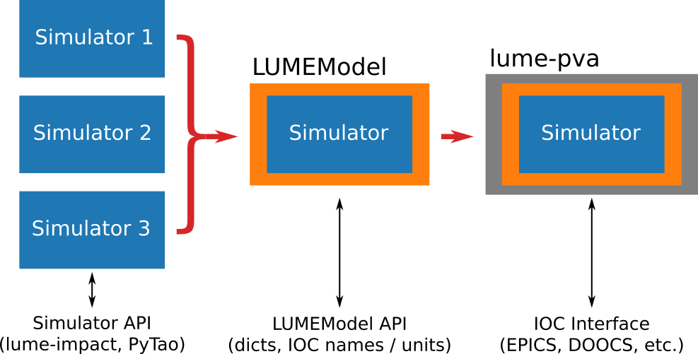
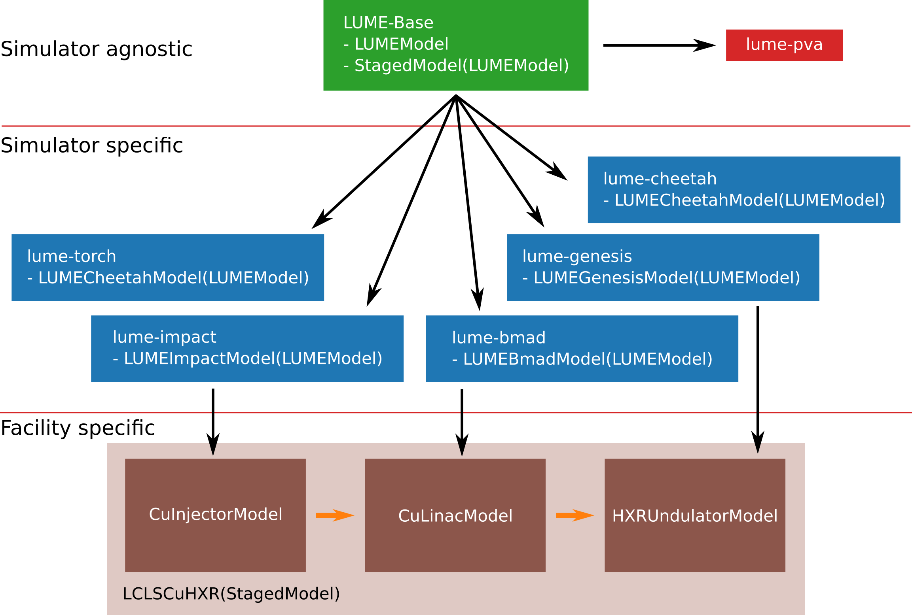

# Welcome to LUME-Science
Lightsource Unified Modeling Environment (LUME) is a common interface and set of data standards for interacting with particle accelerator simulation codes. Set up, modify, and run your simulations from modern Python. Controlling these tools in a programmatic manner enables applications such as optimization, simulation chaining, and virtual accelerator modeling. Get started with LUME today by visiting some of the projects in the organization or visiting our webpage https://www.lume.science/.

See the arXiv paper here https://arxiv.org/abs/2606.07250.

The LUMEModel API provided by LUME-Science aims to enable multiple entry points to accelerator simulations via underlying simulator codes, a standardized get/set API, and via IOC control (e.g. EPICS) as shown below:

  

For ease of use, we provide a "batteries included" set of packages to wrap individual accelerator codes. A visual representation of the package structure is shown below. Users can use these packages to contruct facility-specific models, such as the LCLSCuHXR beamline.

  

